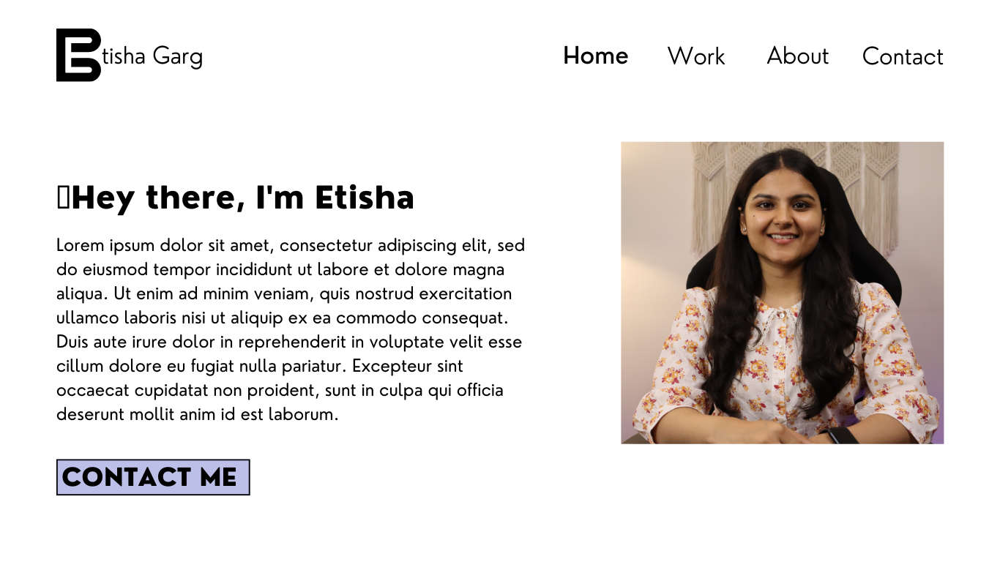
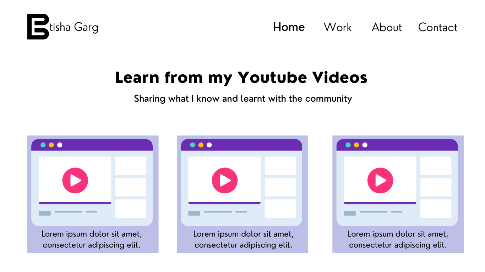
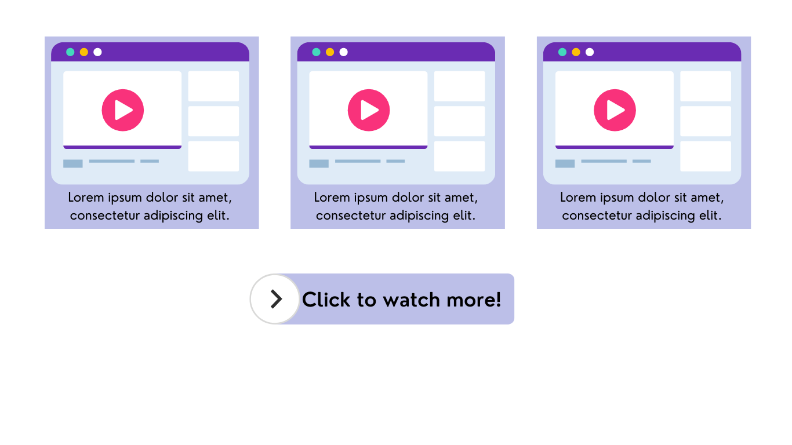
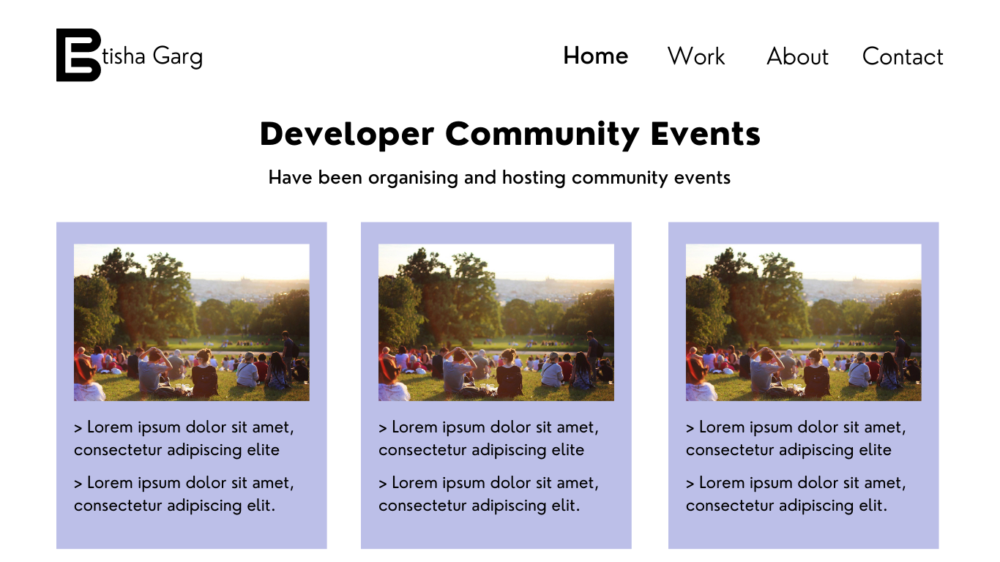
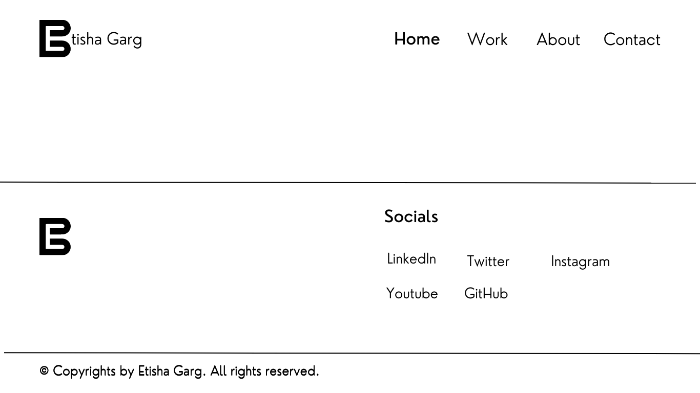
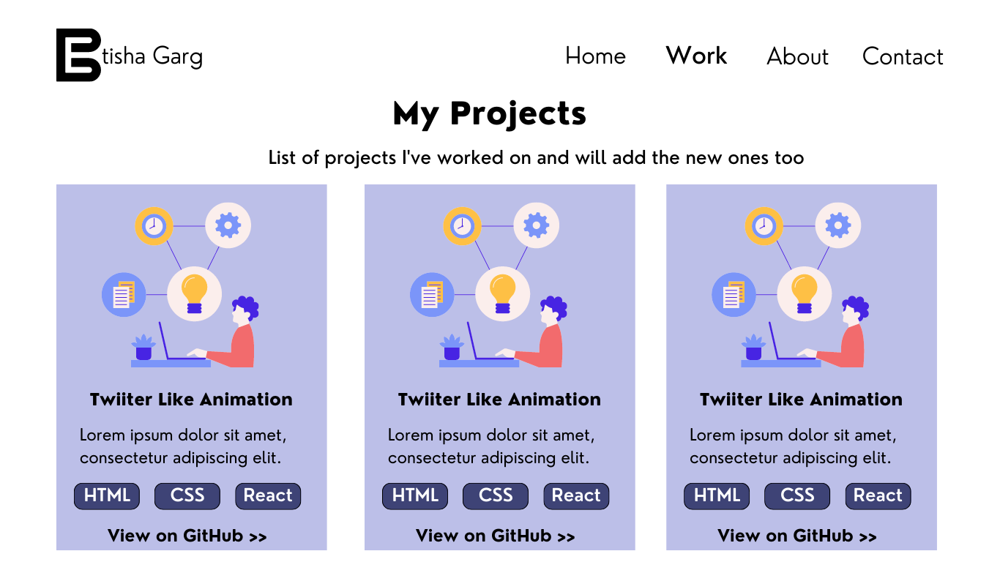
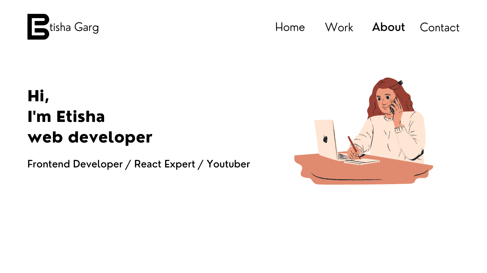
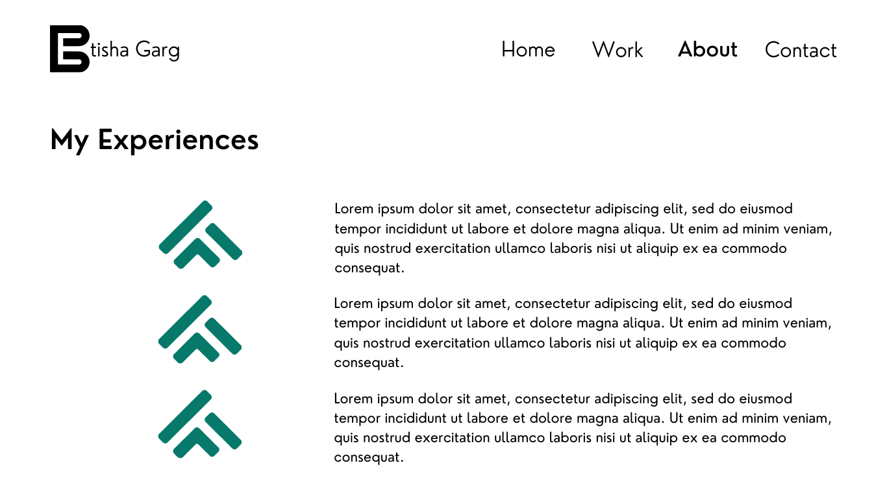
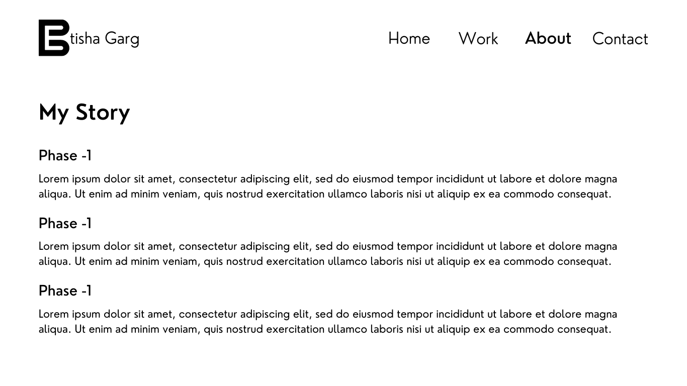
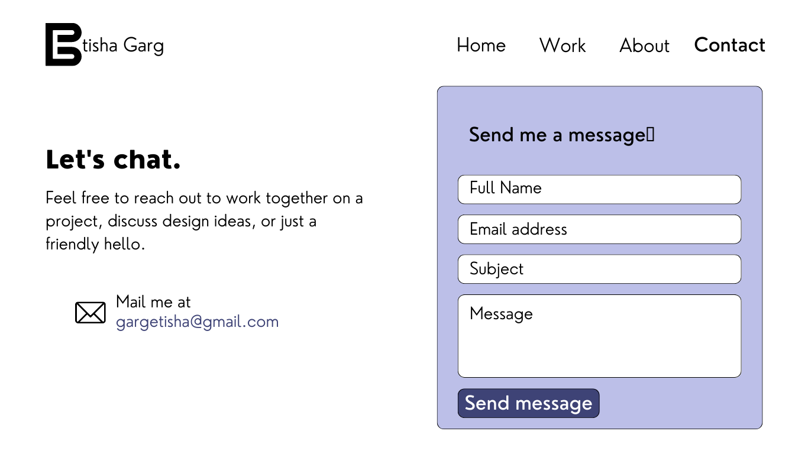

# MY PORTFOLIO

**Welcome to my portfolio website!**

As a software engineer, I firmly believe in the power of a well-curated portfolio. This project represents my entire portfolio, showcasing my skills, experience, and accomplishments in the field of software engineering. By browsing through the different sections and projects on this website, you'll get a comprehensive understanding of my technical abilities, problem-solving capabilities, and dedication to delivering high-quality software solutions.

## Sample Website Design

### Home

### Footer

### Work

### About

### About

